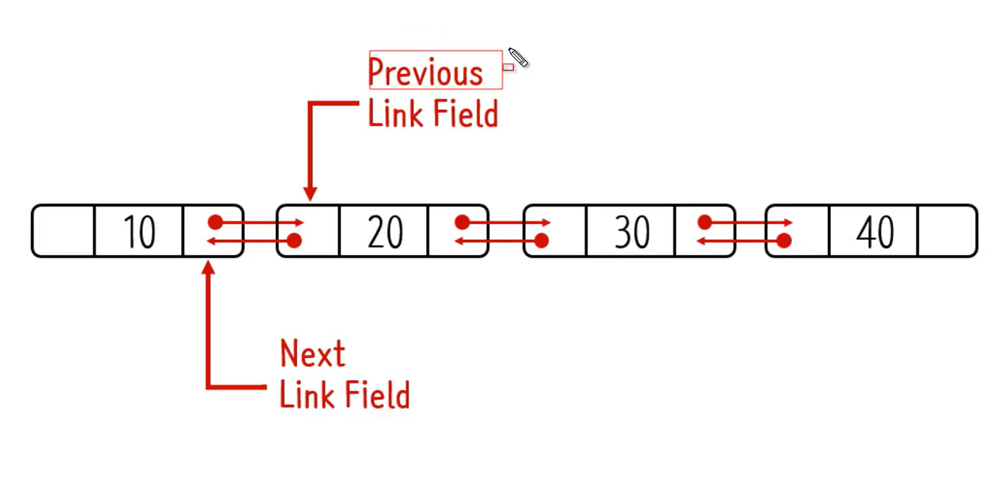
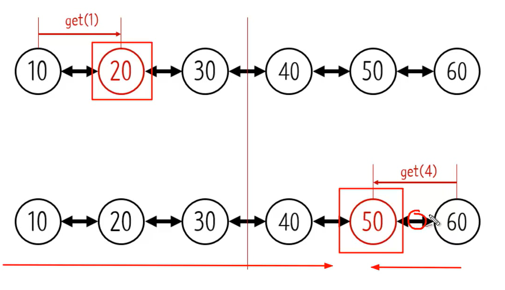

# Doubly Linked List

- `양방향`
- Singly LInked List 의 경우 Node 에는 next만 가지고 있었다.

- previous Link 필드까지 추가
- 🆙 **장점**
    - index를 통해서 값을 가져오는 get 함수를 사용 할 때 좀 더 빠르게 해당 Node를 빠르게 찾을 수 있다.

  

    - 이전 노드가 있기 때문에 반대로 조회를 시작할 수 있다.
    - 순차적으로 이동해야하는 LinkedList의 단점을 보완

- 👎 **단점**
    - 메모리르 더 많이 사용 ⇒ previous 필드를 사용하기 때문에
    - **좀** 더 복잡

⇒ 그럼에도 애플리케이션에서 많이 사용하는 자료구조 , **중요하다**