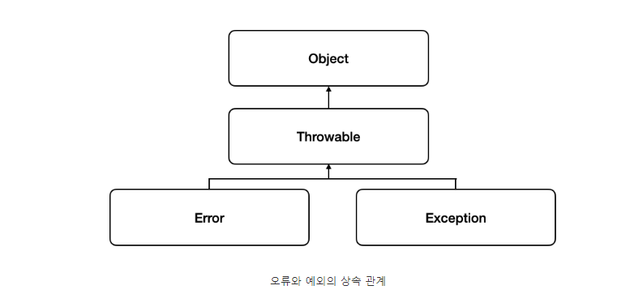
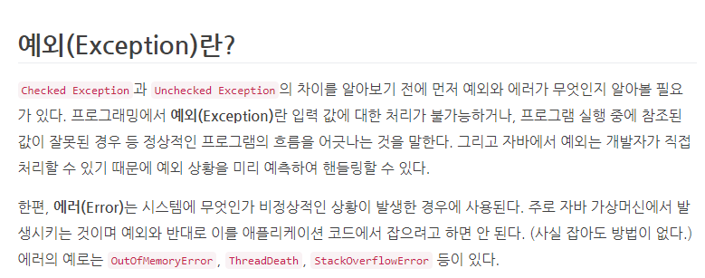
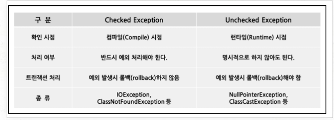
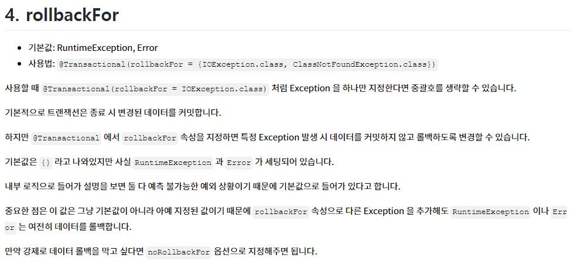

# Error 와 Exception 차이

### Throwable

Java의 에러와 예외 계층에 대한 루트 역할

getMessage 와 printStackTrace 가 구현되어 있음

### Error 와 Exception 차이

- Error : 시스템이 종료되어야할 수준의 상황 같은 수습할 수 없는 심각한 문제
  개발자가 예측하여 방지할 수 없음 → Application Code에서 처리할 수 없는 문제

- Exception : 개발자가 구현한 로직에서 발생한 실수나 사용자의 영향에 의해 발생
  미리 예측하여 방지할 수 있음 ⇒ 상황에 맞는 예외처리를 해야 한다.

### checked Exception 과 unchecked Exception 의 차이

- Compile 시 체크하는 Exception , Applicaton 운영 시 발생하는 Exception

- 트랜잭션 처리 부분 ⇒ 내용은 잘못되있는 내용으로 판단

  Spring @Transcational 을 살펴보면 rollbackFor 옵션의 기본값으로 Checked Exception 은 롤백하지 않고 Unchecked Exception 는 롤백함

  ⇒ 해당 옵션은 Custom으로 변경 가능함으로써 위 표의 트랜잭션 처리 부분은 잘못된 정보로 판단

If no custom rollback rules are configured in this annotation, the transaction will roll back on `[RuntimeException]`
and `[Error]`  but not on checked exceptions.

- 참고

[자바의 예외의 종류 3가지](https://velog.io/@jsj3282/%EC%9E%90%EB%B0%94%EC%9D%98-%EC%98%88%EC%99%B8%EC%9D%98-%EC%A2%85%EB%A5%98-3%EA%B0%80%EC%A7%80)

[Transactinal(Spring Framework 5.3.22 API)](https://docs.spring.io/spring-framework/docs/current/javadoc-api/org/springframework/transaction/annotation/Transactional.html)